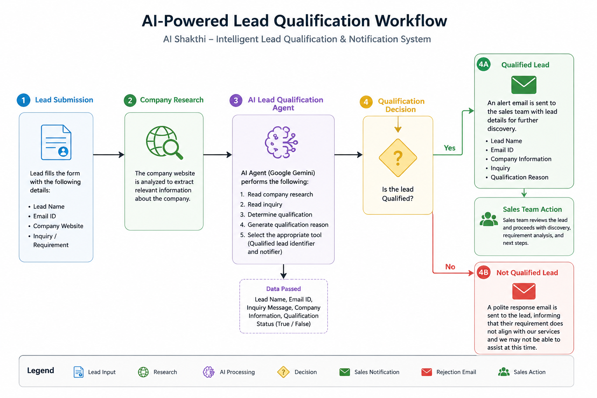

# AI Lead Qualification Agent

## Overview

An AI-powered lead qualification workflow built using n8n, Google Gemini, Firecrawl, and Gmail.

The system automatically:

- Collects lead information
- Researches the company website
- Evaluates lead qualification using AI
- Routes qualified leads to the sales team
- Sends polite rejection emails for non-qualified inquiries

---

## Architecture

---

## Technology Stack

- n8n
- Google Gemini
- Firecrawl
- Gmail
- AI Agents

---

## Workflow

### Lead Qualification Agent

1. Lead submits form
2. Company website is researched
3. AI Agent evaluates:
   - Company fit
   - Inquiry relevance
4. Lead is marked:
   - Qualified
   - Not Qualified

### Qualified Lead Workflow

Qualified leads:

- Notify Sales Team
- Include lead details
- Include qualification reason

Not Qualified leads:

- Send polite rejection email

---

## Sample Screenshots

### Lead Qualification Workflow

### Notification Workflow

---

## Future Enhancements

- CRM Integration
- Slack Notifications
- Lead Scoring
- Multi-stage Qualification
- Analytics Dashboard

---

## Author

Sandhiya T S
