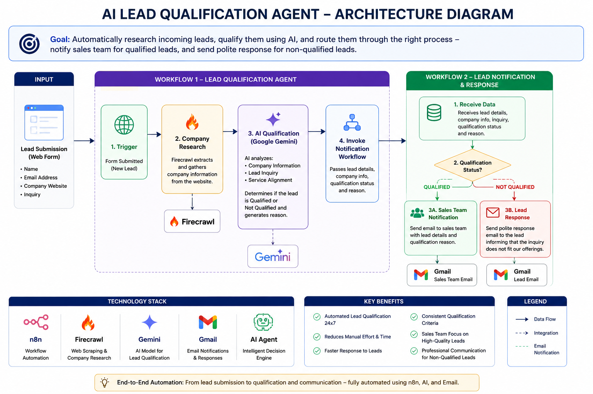
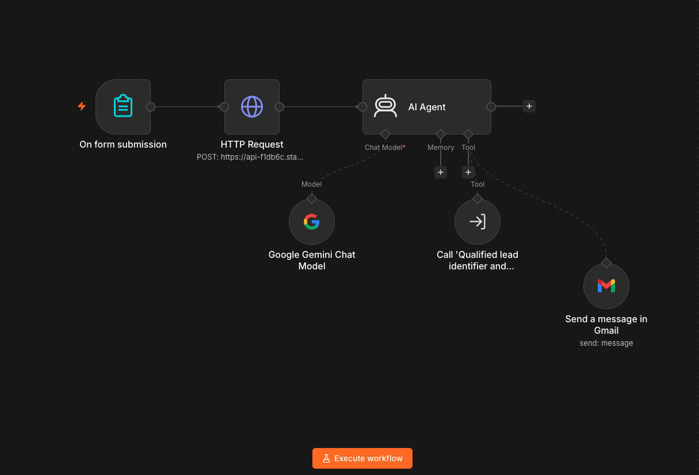
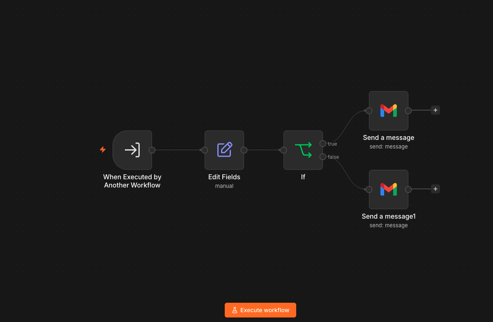
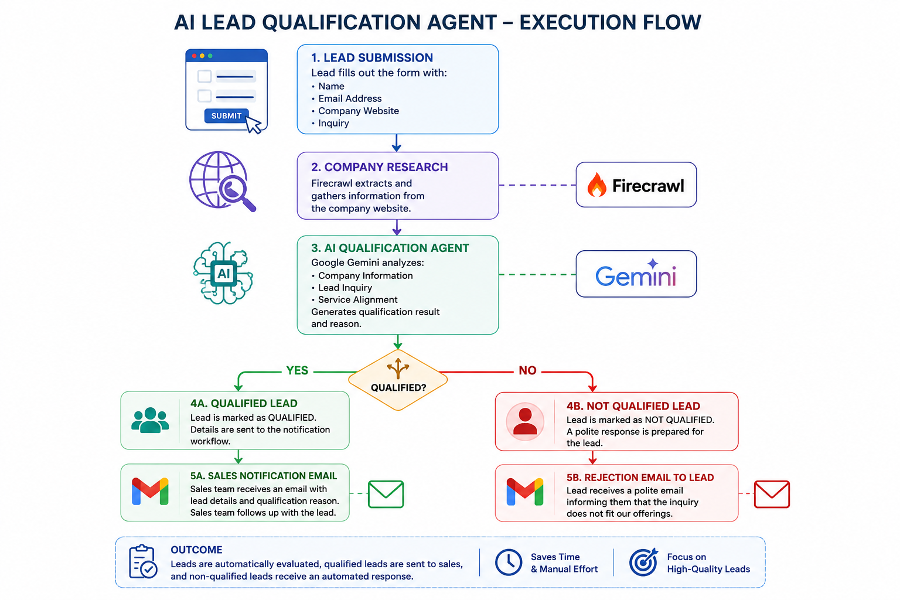

# AI Lead Qualification Agent

## Overview

The AI Lead Qualification Agent is an automated lead qualification solution built using n8n, Google Gemini, Firecrawl, and Gmail.

The solution automatically evaluates inbound leads by analyzing company information and inquiry details, determines whether the lead is a good fit for AI Shakthi's services, and routes them through the appropriate business process.

The workflow reduces manual effort, improves response times, and enables sales teams to focus on high-potential opportunities.

---

## Business Problem

Organizations receive inquiries from prospects with different business requirements. Manually reviewing each lead, researching the company, and determining service fit can be time-consuming and inconsistent.

This solution automates the process by:

- Researching the prospect's company website
- Understanding the inquiry using AI
- Evaluating service alignment
- Automatically routing qualified and non-qualified leads
- Notifying the sales team of qualified opportunities

---

## Solution Architecture



---

## Workflow Overview

### Workflow 1 - Lead Qualification Agent

1. Lead submits a form containing:
   - Lead Name
   - Email Address
   - Company Website
   - Inquiry

2. Company information is extracted using Firecrawl.

3. Google Gemini analyzes:
   - Company profile
   - Business inquiry
   - Service alignment

4. The AI Agent determines:
   - Qualified
   - Not Qualified

5. The AI Agent generates a qualification reason and invokes the notification workflow.

---

### Workflow 2 - Lead Notification & Response

The second workflow receives:

- Lead Name
- Email Address
- Company Information
- Inquiry
- Qualification Status

The workflow evaluates the qualification status and routes the lead accordingly.

#### Qualified Lead

- Sales team receives an email notification
- Lead details are shared
- Qualification reason is included
- Sales team can proceed with discovery and follow-up

#### Not Qualified Lead

- Prospect receives a polite response
- Inquiry is gracefully declined
- No manual intervention is required

---

## Workflow Screenshots

### Lead Qualification Workflow



### Lead Notification Workflow



### Sample Execution



---

## Technology Stack

| Component | Technology |
|------------|------------|
| Workflow Automation | n8n |
| AI Model | Google Gemini |
| Website Research | Firecrawl |
| Email Notifications | Gmail |
| AI Decision Engine | AI Agent |

---

## Qualification Logic

The AI Agent evaluates:

### Company Profile

- Industry
- Business Type
- Technology Focus
- Service Alignment

### Inquiry Relevance

The inquiry is evaluated for alignment with AI Shakthi's offerings:

- AI Agents
- Agentic AI
- Workflow Automation
- Software Development
- System Integrations
- Business Process Automation
- Digital Transformation
- Custom Applications

### Qualification Outcome

A lead is qualified when there is a strong alignment between the prospect's requirements and AI Shakthi's service offerings.

---

## Business Benefits

- Automated lead qualification
- Reduced manual effort
- Faster response times
- Consistent qualification criteria
- Improved sales productivity
- Better lead prioritization
- Automated customer communication

---

## Repository Structure

```text
AI-Lead-Qualification-Agent
│
├── README.md
│
├── docs
│   └── architecture-diagram.png
│
├── workflows
│   ├── lead-qualification-agent.json
│   └── qualified-lead-notifier.json
│
└── screenshots
    ├── workflow-1.png
    ├── workflow-2.png
    └── sample-execution.png
```

---

## Future Enhancements

- CRM Integration
- Lead Scoring (Hot / Warm / Cold)
- Slack / Microsoft Teams Notifications
- Analytics Dashboard
- Multi-stage Qualification
- Meeting Scheduling Automation
- Proposal Generation

---

## Author

**Sandhiya T S**

Senior Solutions Professional with 27+ years of experience in solution consulting, cybersecurity, cloud technologies, automation, and AI-driven business transformation.

---

## License

This project is shared for learning, demonstration, and portfolio purposes.
